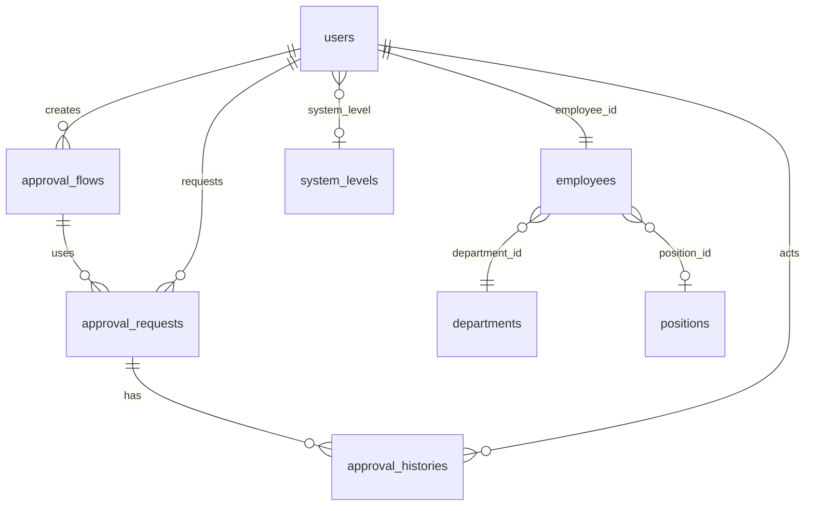
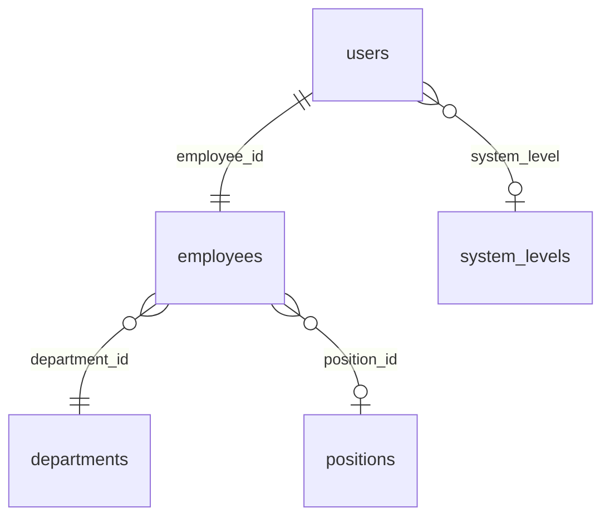

# 承認フロー データベーススキーマ詳細（新仕様対応）

## 概要

新承認フローシステムは、JSONカラムを活用した柔軟な設計により、従来の複雑なテーブル構造を簡素化し、条件分岐や動的承認フローに対応しています。

## テーブル構成



## 1. approval_flows テーブル（新仕様）

### 概要
承認フローの基本情報とJSON形式での柔軟な設定を管理するマスターテーブル

### スキーマ
```sql
CREATE TABLE approval_flows (
    id BIGINT UNSIGNED NOT NULL AUTO_INCREMENT PRIMARY KEY,
    name VARCHAR(255) NOT NULL,                    -- フロー名
    description TEXT NULL,                         -- 説明
    flow_type VARCHAR(50) NOT NULL DEFAULT 'general', -- フロータイプ
    conditions JSON NULL,                          -- 適用条件
    priority INT NOT NULL DEFAULT 1,              -- 優先度
    requesters JSON NULL,                          -- 承認依頼者設定
    approval_steps JSON NULL,                      -- 承認ステップ設定
    is_active BOOLEAN NOT NULL DEFAULT 1,         -- アクティブ状態
    created_by BIGINT UNSIGNED NULL,              -- 作成者
    updated_by BIGINT UNSIGNED NULL,              -- 更新者
    created_at TIMESTAMP NULL,
    updated_at TIMESTAMP NULL,
    deleted_at TIMESTAMP NULL,
    
    INDEX idx_flow_type (flow_type),
    INDEX idx_priority (priority),
    INDEX idx_is_active (is_active),
    INDEX idx_conditions ON approval_flows USING GIN (conditions),
    INDEX idx_requesters ON approval_flows USING GIN (requesters),
    INDEX idx_approval_steps ON approval_flows USING GIN (approval_steps),
    FOREIGN KEY (created_by) REFERENCES users(id) ON DELETE SET NULL,
    FOREIGN KEY (updated_by) REFERENCES users(id) ON DELETE SET NULL
);
```

### フィールド詳細
- **flow_type**: `estimate`, `budget`, `purchase`, `contract`, `general`
- **conditions**: フローの適用条件（金額、部署、プロジェクト等）
- **requesters**: 承認依頼者設定（システム権限レベル、職位、部署、個別ユーザー）
- **approval_steps**: 承認ステップ設定（最大5ステップ、条件分岐、並列承認対応）

### JSON構造例

#### conditions（適用条件）
```json
{
  "amount_min": 0,
  "amount_max": 10000000,
  "project_types": ["construction", "renovation"],
  "departments": [1, 2, 3]
}
```

#### requesters（承認依頼者設定）
```json
[
  {
    "type": "department",
    "value": 1,
    "display_name": "Aチーム"
  },
  {
    "type": "system_level",
    "value": "supervisor",
    "display_name": "上長"
  },
]
```

#### approval_steps（承認ステップ設定）
```json
[
  {
    "step": 0,
    "name": "承認依頼作成",
    "approvers": [
      {
        "type": "system_level",
        "value": "employee",
        "display_name": "担当者"
      }
    ],
    "available_permissions": [
      "estimate.approval.request"
    ]
  },
  {
    "step": 1,
    "name": "第1承認",
    "approvers": [
      {
        "type": "system_level",
        "value": "supervisor",
        "display_name": "上長"
      }
    ],
    "available_permissions": [
      "estimate.approval.view",
      "estimate.approval.approve",
      "estimate.approval.return"
    ],
    "condition": {
      "type": "required",
      "display_name": "必須承認"
    }
  },
  {
    "step": 2,
    "name": "条件分岐承認",
    "approvers": [
      {
        "type": "conditional",
        "condition": {
          "field": "amount",
          "operator": ">=",
          "value": 5000000
        },
        "approvers": [
          {
            "type": "system_level",
            "value": "executive",
            "display_name": "最高責任者"
          }
        ]
      }
    ],
    "condition": {
      "type": "required",
      "display_name": "必須承認"
    }
  }
]
```

### 使用例
```php
// 見積承認フローの作成
ApprovalFlow::create([
    'name' => '見積承認フロー（金額別）',
    'description' => '金額に応じた段階的承認フロー',
    'flow_type' => 'estimate',
    'conditions' => [
        'amount_min' => 0,
        'amount_max' => 50000000,
        'project_types' => ['construction', 'renovation']
    ],
    'requesters' => [
        ['type' => 'department', 'value' => 1, 'display_name' => 'Aチーム'],
        ['type' => 'department', 'value' => 2, 'display_name' => 'Bチーム'],
    ],
    'approval_steps' => [
        [
            'step' => 0,
            'name' => '承認依頼作成',
            'approvers' => [
                ['type' => 'system_level', 'value' => 'supervisor', 'display_name' => '上長']
            ],
            'available_permissions' => [
                'estimate.approval.request'
            ]
        ],
        [
            'step' => 1,
            'name' => 'チームリーダー承認',
            'approvers' => [
                ['type' => 'position', 'value' => 1, 'display_name' => 'チームリーダー'] // position_id
            ],
            'available_permissions' => [
                'estimate.approval.view',
                'estimate.approval.approve',
                'estimate.approval.return'
            ],
            'condition' => ['type' => 'required', 'display_name' => '必須承認']
        ],
        [
            'step' => 2,
            'name' => '部門長承認',
            'approvers' => [
                [
                    'type' => 'conditional',
                    'condition' => ['field' => 'amount', 'operator' => '>=', 'value' => 1000000],
                    'approvers' => [
                        ['type' => 'position', 'value' => 2, 'display_name' => '部門長'] // position_id
                    ]
                ]
            ],
            'condition' => ['type' => 'required', 'display_name' => '必須承認']
        ]
    ],
    'priority' => 1,
    'is_active' => true
]);
```

### 承認者タイプの値について
- **system_level**: `system_levels.code`の値（例: 'supervisor', 'manager', 'executive'）
- **position**: `positions.id`の値（例: 1, 2, 3）
- **user**: `users.id`の値（例: 1, 2, 3）
- **department**: `departments.id`の値（例: 1, 2, 3）

### 承認依頼者設定について
- **使用可能タイプ**: `system_level`, `position`, `user`, `department`のみ
- **権限ベース**: 承認依頼者設定では使用しない
- **権限制御**: 承認操作時（ステップの`available_permissions`）で行う

### ステップ権限設定について
- **available_permissions**: そのステップで利用可能な権限の配列
- **ステップ0（承認依頼作成）**: `estimate.approval.request`
- **ステップ1以降（承認操作）**: `estimate.approval.view`, `estimate.approval.approve`, `estimate.approval.reject`, `estimate.approval.return`, `estimate.approval.cancel`
- **権限チェック**: ユーザー個別の権限チェックは不要（ステップ設定が権限を制御）

## 2. approval_requests テーブル（更新）

### 概要
実際の承認依頼を管理するテーブル（新仕様対応）

### スキーマ
```sql
CREATE TABLE approval_requests (
    id BIGINT UNSIGNED NOT NULL AUTO_INCREMENT PRIMARY KEY,
    approval_flow_id BIGINT UNSIGNED NOT NULL,    -- 承認フローID
    request_type VARCHAR(50) NOT NULL,            -- 依頼タイプ
    request_id UUID NOT NULL,                     -- 依頼元ID（UUID対応）
    title VARCHAR(255) NOT NULL,                  -- タイトル
    description TEXT NULL,                        -- 説明
    request_data JSON NULL,                       -- 依頼データ
    current_step INT NOT NULL DEFAULT 1,          -- 現在のステップ番号
    status VARCHAR(20) NOT NULL DEFAULT 'pending', -- ステータス
    priority VARCHAR(20) NOT NULL DEFAULT 'normal', -- 優先度
    requested_by BIGINT UNSIGNED NOT NULL,        -- 依頼者
    approved_by BIGINT UNSIGNED NULL,             -- 承認者
    approved_at TIMESTAMP NULL,                   -- 承認日時
    rejected_by BIGINT UNSIGNED NULL,             -- 却下者
    rejected_at TIMESTAMP NULL,                   -- 却下日時
    returned_by BIGINT UNSIGNED NULL,             -- 差し戻し者
    returned_at TIMESTAMP NULL,                   -- 差し戻し日時
    cancelled_by BIGINT UNSIGNED NULL,            -- キャンセル者
    cancelled_at TIMESTAMP NULL,                  -- キャンセル日時
    expires_at TIMESTAMP NULL,                    -- 期限日時
    created_by BIGINT UNSIGNED NULL,              -- 作成者
    updated_by BIGINT UNSIGNED NULL,              -- 更新者
    created_at TIMESTAMP NULL,
    updated_at TIMESTAMP NULL,
    deleted_at TIMESTAMP NULL,
    
    INDEX idx_approval_flow_id (approval_flow_id),
    INDEX idx_request_type (request_type),
    INDEX idx_request_id (request_id),
    INDEX idx_current_step (current_step),
    INDEX idx_status (status),
    INDEX idx_priority (priority),
    INDEX idx_requested_by (requested_by),
    INDEX idx_approved_by (approved_by),
    INDEX idx_rejected_by (rejected_by),
    INDEX idx_returned_by (returned_by),
    INDEX idx_cancelled_by (cancelled_by),
    INDEX idx_expires_at (expires_at),
    FOREIGN KEY (approval_flow_id) REFERENCES approval_flows(id) ON DELETE CASCADE,
    FOREIGN KEY (requested_by) REFERENCES users(id) ON DELETE CASCADE,
    FOREIGN KEY (approved_by) REFERENCES users(id) ON DELETE SET NULL,
    FOREIGN KEY (rejected_by) REFERENCES users(id) ON DELETE SET NULL,
    FOREIGN KEY (returned_by) REFERENCES users(id) ON DELETE SET NULL,
    FOREIGN KEY (cancelled_by) REFERENCES users(id) ON DELETE SET NULL,
    FOREIGN KEY (created_by) REFERENCES users(id) ON DELETE SET NULL,
    FOREIGN KEY (updated_by) REFERENCES users(id) ON DELETE SET NULL
);
```

### フィールド詳細
- **request_id**: UUID形式で依頼元のIDを格納
- **current_step**: 現在の承認ステップ番号（1-5）
- **request_data**: 依頼データをJSON形式で格納（条件分岐判定に使用）

### ステータス
- **pending**: 承認待ち
- **approved**: 承認済み
- **rejected**: 却下
- **returned**: 差し戻し
- **cancelled**: キャンセル

### 優先度
- **low**: 低
- **normal**: 通常
- **high**: 高
- **urgent**: 緊急

### request_data例
```json
{
  "amount": 1500000,
  "project_type": "construction",
  "vendor_type": "new",
  "department_id": 1,
  "user_id": 123,
  "custom_fields": {
    "project_name": "新築工事",
    "location": "東京都渋谷区"
  }
}
```

## 3. approval_histories テーブル（更新）

### 概要
承認処理の履歴を記録するテーブル（新仕様対応）

### スキーマ
```sql
CREATE TABLE approval_histories (
    id BIGINT UNSIGNED NOT NULL AUTO_INCREMENT PRIMARY KEY,
    approval_request_id BIGINT UNSIGNED NOT NULL, -- 承認依頼ID
    step INT NOT NULL,                            -- ステップ番号
    action VARCHAR(20) NOT NULL,                  -- アクション
    acted_by BIGINT UNSIGNED NOT NULL,            -- 実行者
    acted_at TIMESTAMP NOT NULL DEFAULT CURRENT_TIMESTAMP, -- 実行日時
    comment TEXT NULL,                            -- コメント
    delegated_to BIGINT UNSIGNED NULL,            -- 委譲先
    delegated_at TIMESTAMP NULL,                  -- 委譲日時
    created_by BIGINT UNSIGNED NULL,              -- 作成者
    updated_by BIGINT UNSIGNED NULL,              -- 更新者
    created_at TIMESTAMP NULL,
    updated_at TIMESTAMP NULL,
    deleted_at TIMESTAMP NULL,
    
    INDEX idx_approval_request_id (approval_request_id),
    INDEX idx_step (step),
    INDEX idx_action (action),
    INDEX idx_acted_by (acted_by),
    INDEX idx_acted_at (acted_at),
    INDEX idx_delegated_to (delegated_to),
    FOREIGN KEY (approval_request_id) REFERENCES approval_requests(id) ON DELETE CASCADE,
    FOREIGN KEY (acted_by) REFERENCES users(id) ON DELETE CASCADE,
    FOREIGN KEY (delegated_to) REFERENCES users(id) ON DELETE SET NULL,
    FOREIGN KEY (created_by) REFERENCES users(id) ON DELETE SET NULL,
    FOREIGN KEY (updated_by) REFERENCES users(id) ON DELETE SET NULL
);
```

### フィールド詳細
- **step**: 承認ステップ番号（1-5）
- **action**: 実行されたアクション
- **acted_by**: アクションを実行したユーザーID
- **acted_at**: アクション実行日時

### アクション
- **approve**: 承認
- **reject**: 却下
- **return**: 差し戻し
- **cancel**: キャンセル
- **delegate**: 委譲

## 4. 関連テーブル

### 4.1 users テーブル（既存）
承認フローシステムで使用する既存のユーザーテーブル

```sql
-- 基本構造（既存）
CREATE TABLE users (
    id BIGINT UNSIGNED NOT NULL AUTO_INCREMENT PRIMARY KEY,
    employee_id BIGINT UNSIGNED NOT NULL,         -- 社員ID（employeesテーブルへの外部キー）
    login_id VARCHAR(255) NOT NULL UNIQUE,        -- ログインID
    password VARCHAR(255) NOT NULL,               -- パスワード
    system_level VARCHAR(50) NULL,                -- システム権限レベル
    is_active BOOLEAN DEFAULT true,               -- アクティブ状態
    created_at TIMESTAMP NULL,
    updated_at TIMESTAMP NULL,
    
    FOREIGN KEY (employee_id) REFERENCES employees(id) ON DELETE CASCADE
);
```

### 4.2 employees テーブル（既存）
社員情報を管理する既存テーブル（部署・職位情報を含む）

```sql
-- 基本構造（既存）
CREATE TABLE employees (
    id BIGINT UNSIGNED NOT NULL AUTO_INCREMENT PRIMARY KEY,
    employee_id VARCHAR(50) UNIQUE,               -- 社員ID
    name VARCHAR(255) NOT NULL,                   -- 氏名
    name_kana VARCHAR(255) NULL,                  -- フリガナ
    email VARCHAR(255) NULL UNIQUE,               -- メールアドレス
    department_id BIGINT UNSIGNED NOT NULL,       -- 所属部署ID
    position_id BIGINT UNSIGNED NULL,             -- 職位ID
    is_active BOOLEAN DEFAULT true,               -- 在職状況
    created_at TIMESTAMP NULL,
    updated_at TIMESTAMP NULL,
    deleted_at TIMESTAMP NULL,
    
    FOREIGN KEY (department_id) REFERENCES departments(id) ON DELETE RESTRICT,
    FOREIGN KEY (position_id) REFERENCES positions(id) ON DELETE SET NULL
);
```

### 4.3 departments テーブル（既存）
部署情報を管理する既存テーブル

```sql
-- 基本構造（既存）
CREATE TABLE departments (
    id BIGINT UNSIGNED NOT NULL AUTO_INCREMENT PRIMARY KEY,
    name VARCHAR(255) NOT NULL,                   -- 部署名
    code VARCHAR(100) UNIQUE,                     -- 部署コード
    description TEXT NULL,                        -- 説明
    is_active BOOLEAN DEFAULT true,               -- アクティブ状態
    created_at TIMESTAMP NULL,
    updated_at TIMESTAMP NULL
);
```

### 4.4 positions テーブル（既存）
職位情報を管理する既存テーブル

```sql
-- 基本構造（既存）
CREATE TABLE positions (
    id BIGINT UNSIGNED NOT NULL AUTO_INCREMENT PRIMARY KEY,
    name VARCHAR(255) NOT NULL,                   -- 職位名
    code VARCHAR(100) UNIQUE,                     -- 職位コード
    level INT NULL,                               -- 職位レベル
    is_active BOOLEAN DEFAULT true,               -- アクティブ状態
    created_at TIMESTAMP NULL,
    updated_at TIMESTAMP NULL
);
```

### 4.5 system_levels テーブル（既存）
システム権限レベルを管理する既存テーブル

```sql
-- 基本構造（既存）
CREATE TABLE system_levels (
    id BIGINT UNSIGNED NOT NULL AUTO_INCREMENT PRIMARY KEY,
    name VARCHAR(255) NOT NULL,                   -- 権限レベル名
    code VARCHAR(50) UNIQUE,                      -- 権限レベルコード
    level INT NOT NULL,                           -- 権限レベル数値
    description TEXT NULL,                        -- 説明
    is_active BOOLEAN DEFAULT true,               -- アクティブ状態
    created_at TIMESTAMP NULL,
    updated_at TIMESTAMP NULL
);
```

### 4.6 テーブル関係図


## 5. インデックス戦略（新仕様対応）

### パフォーマンス最適化
新仕様では以下の観点でインデックスを設定：

1. **外部キー**: 全ての外部キーにインデックス
2. **検索条件**: よく使用される検索条件にインデックス
3. **JSONカラム**: GINインデックスでJSON検索を高速化
4. **複合インデックス**: 複数条件での検索に対応

### JSONカラムのインデックス
```sql
-- GINインデックスでJSON検索を高速化
CREATE INDEX idx_approval_flows_conditions ON approval_flows USING GIN (conditions);
CREATE INDEX idx_approval_flows_requesters ON approval_flows USING GIN (requesters);
CREATE INDEX idx_approval_flows_approval_steps ON approval_flows USING GIN (approval_steps);
CREATE INDEX idx_approval_requests_request_data ON approval_requests USING GIN (request_data);
```

### クエリ例とインデックス活用
```sql
-- 承認待ちの依頼一覧（idx_status活用）
SELECT * FROM approval_requests WHERE status = 'pending';

-- 特定ユーザーの承認依頼（idx_requested_by活用）
SELECT * FROM approval_requests WHERE requested_by = 1;

-- 期限切れ依頼の検索（idx_expires_at活用）
SELECT * FROM approval_requests WHERE expires_at < NOW();

-- JSON条件での検索（GINインデックス活用）
SELECT * FROM approval_flows 
WHERE conditions @> '{"amount_min": 1000000}'::jsonb;

-- 部署ベースの承認フロー検索
SELECT * FROM approval_flows 
WHERE requesters @> '[{"type": "department", "value": 1}]'::jsonb;
```

## 6. データ整合性（新仕様対応）

### 制約条件
1. **外部キー制約**: データ整合性を保証
2. **CASCADE削除**: 親レコード削除時の子レコード処理
3. **SET NULL**: 参照先削除時のNULL設定
4. **JSON制約**: JSON形式のデータ構造を保証

### トランザクション管理
新仕様の承認処理では複数テーブルの更新が発生するため、適切なトランザクション管理が重要：

```php
DB::transaction(function () use ($request, $user, $comment) {
    // 1. approval_requests更新
    $request->update(['status' => 'approved', 'approved_by' => $user->id]);
    
    // 2. approval_histories作成
    $request->histories()->create([
        'step' => $request->current_step,
        'action' => 'approve',
        'acted_by' => $user->id,
        'comment' => $comment
    ]);
    
    // 3. 次のステップへの進行判定
    $this->processNextStep($request);
});
```

## 7. 拡張性への配慮（新仕様対応）

### JSON フィールドの活用
- **conditions**: フローの適用条件を柔軟に定義
- **requesters**: 承認依頼者を複数の条件で設定
- **approval_steps**: 承認ステップを条件分岐・並列承認対応で設定
- **request_data**: 依頼データをJSON形式で格納

### 条件分岐対応
```php
// 条件分岐の例
$conditions = [
    'amount' => ['operator' => '>=', 'value' => 1000000],
    'department' => ['operator' => '==', 'value' => 1], // departments.id
    'project_type' => ['operator' => 'in', 'value' => ['construction', 'renovation']]
];
```

### 動的承認フロー
```php
// 動的フロー選択の例
$applicableFlows = ApprovalFlow::where('is_active', true)
    ->where('flow_type', $requestData['flow_type'])
    ->whereJsonContains('conditions->amount_min', ['<=' => $requestData['amount']])
    ->orderBy('priority')
    ->get();
```

### 承認者判定の実装例
```php
// 承認者判定の例
public function canApprove($userId, $approvalRequest, $step) {
    $user = User::with('employee')->find($userId);
    $employee = $user->employee;
    
    $flow = $approvalRequest->approvalFlow;
    $stepConfig = $flow->approval_steps[$step - 1];
    
    foreach ($stepConfig['approvers'] as $approver) {
        switch ($approver['type']) {
            case 'system_level':
                if ($user->system_level === $approver['value']) {
                    return true;
                }
                break;
            case 'position':
                if ($employee->position_id == $approver['value']) {
                    return true;
                }
                break;
            case 'user':
                if ($userId == $approver['value']) {
                    return true;
                }
                break;
            case 'department':
                if ($employee->department_id == $approver['value']) {
                    return true;
                }
                break;
            case 'permission':
                // 承認者設定での権限ベースは削除（ステップ権限設定に統合）
                // 権限ベースの承認者は、ステップのavailable_permissionsで制御
                break;
        }
    }
    return false;
}
```

## 8. 新仕様の特徴

### 8.1 テーブル構造の簡素化
- **従来**: 5つのテーブル（approval_flows, approval_steps, approval_conditions, approval_requests, approval_histories）
- **新仕様**: 3つのテーブル（approval_flows, approval_requests, approval_histories）
- **削除**: approval_steps, approval_conditionsテーブルをJSONカラムに統合

### 8.2 柔軟性の向上
- **条件分岐**: JSON条件による動的な承認フロー
- **並列承認**: 複数承認者による同時承認
- **動的選択**: 依頼データに基づく自動フロー選択
- **権限分離**: 承認フロー設定権限と承認操作権限の分離

### 8.3 パフォーマンス最適化
- **GINインデックス**: JSON検索の高速化
- **キャッシュ**: 承認者判定のキャッシュ機能
- **バッチ処理**: 大量データでの効率的な処理

## 9. テーブル統合の理由と実現方法

### 9.1 従来のテーブル設計の問題点

#### 複雑なテーブル構造
```sql
-- 従来の設計（5テーブル構成）
approval_flows          -- 承認フロー基本情報
├── approval_steps      -- 承認ステップ（1:N）
│   └── approval_conditions -- 承認条件（1:N）
├── approval_requests   -- 承認依頼（1:N）
└── approval_histories  -- 承認履歴（1:N）
```

#### 問題点
1. **テーブル数の増加**: 5つのテーブルによる複雑な管理
2. **JOIN処理の複雑化**: 複数テーブルの結合による性能劣化
3. **データ整合性の管理**: 複数テーブル間の整合性維持の困難
4. **拡張性の制限**: 新しい承認パターン追加時の複雑な変更
5. **保守性の低下**: スキーマ変更時の影響範囲の拡大

### 9.2 新仕様での統合アプローチ

#### JSONカラムによる統合
```sql
-- 新仕様の設計（3テーブル構成）
approval_flows          -- 承認フロー（JSON統合）
├── approval_requests   -- 承認依頼（1:N）
└── approval_histories  -- 承認履歴（1:N）

-- JSONカラムで統合された情報
approval_flows.conditions      -- 適用条件（旧approval_conditions）
approval_flows.requesters      -- 承認依頼者設定
approval_flows.approval_steps  -- 承認ステップ（旧approval_steps）
```

### 9.3 統合の具体的な実現方法

#### 9.3.1 承認ステップの統合

**従来の設計**:
```sql
-- approval_stepsテーブル
CREATE TABLE approval_steps (
    id BIGINT UNSIGNED PRIMARY KEY,
    approval_flow_id BIGINT UNSIGNED,
    step_order INT,
    name VARCHAR(255),
    condition_type VARCHAR(50),
    condition_value JSON,
    FOREIGN KEY (approval_flow_id) REFERENCES approval_flows(id)
);

-- approval_conditionsテーブル
CREATE TABLE approval_conditions (
    id BIGINT UNSIGNED PRIMARY KEY,
    approval_step_id BIGINT UNSIGNED,
    condition_type VARCHAR(50),
    condition_value JSON,
    FOREIGN KEY (approval_step_id) REFERENCES approval_steps(id)
);
```

**新仕様での統合**:
```sql
-- approval_flowsテーブルのJSONカラム
CREATE TABLE approval_flows (
    id BIGINT UNSIGNED PRIMARY KEY,
    name VARCHAR(255),
    approval_steps JSON,  -- 承認ステップ情報を統合
    -- その他のフィールド...
);
```

**JSON構造例**:
```json
{
  "approval_steps": [
    {
      "step": 1,
      "name": "第1承認",
      "approvers": [
        {
          "type": "system_level",
          "value": "supervisor",
          "display_name": "上長"
        }
      ],
      "condition": {
        "type": "required",
        "display_name": "必須承認"
      }
    },
    {
      "step": 2,
      "name": "条件分岐承認",
      "approvers": [
        {
          "type": "conditional",
          "condition": {
            "field": "amount",
            "operator": ">=",
            "value": 5000000
          },
          "approvers": [
            {
              "type": "system_level",
              "value": "executive",
              "display_name": "最高責任者"
            }
          ]
        }
      ],
      "condition": {
        "type": "required",
        "display_name": "必須承認"
      }
    }
  ]
}
```

#### 9.3.2 適用条件の統合

**従来の設計**:
```sql
-- approval_conditionsテーブル
CREATE TABLE approval_conditions (
    id BIGINT UNSIGNED PRIMARY KEY,
    approval_flow_id BIGINT UNSIGNED,
    condition_type VARCHAR(50),
    condition_value JSON,
    FOREIGN KEY (approval_flow_id) REFERENCES approval_flows(id)
);
```

**新仕様での統合**:
```sql
-- approval_flowsテーブルのJSONカラム
CREATE TABLE approval_flows (
    id BIGINT UNSIGNED PRIMARY KEY,
    name VARCHAR(255),
    conditions JSON,  -- 適用条件を統合
    -- その他のフィールド...
);
```

**JSON構造例**:
```json
{
  "conditions": {
    "amount_min": 0,
    "amount_max": 10000000,
    "project_types": ["construction", "renovation"],
    "departments": [1, 2, 3],
    "custom_conditions": [
      {
        "field": "vendor_type",
        "operator": "==",
        "value": "new"
      }
    ]
  }
}
```

### 9.4 統合によるメリット

#### 9.4.1 管理の簡素化
```php
// 従来: 複数テーブルの管理
$flow = ApprovalFlow::with(['steps.conditions'])->find($id);
$steps = $flow->steps;
foreach ($steps as $step) {
    $conditions = $step->conditions;
    // 複雑な処理...
}

// 新仕様: 単一テーブルでの管理
$flow = ApprovalFlow::find($id);
$steps = $flow->approval_steps;  // JSON配列
$conditions = $flow->conditions; // JSONオブジェクト
// シンプルな処理...
```

#### 9.4.2 パフォーマンスの向上
```sql
-- 従来: 複数テーブルのJOIN
SELECT af.*, ast.*, ac.*
FROM approval_flows af
LEFT JOIN approval_steps ast ON af.id = ast.approval_flow_id
LEFT JOIN approval_conditions ac ON ast.id = ac.approval_step_id
WHERE af.id = 1;

-- 新仕様: 単一テーブルでの検索
SELECT * FROM approval_flows WHERE id = 1;
-- JSONデータはアプリケーション層で処理
```

#### 9.4.3 拡張性の向上
```php
// 新しい承認パターンの追加が容易
$newStep = [
    'step' => 3,
    'name' => '並列承認',
    'approvers' => [
        [
            'type' => 'parallel',
            'approvers' => [
                ['type' => 'department', 'value' => 1],
                ['type' => 'department', 'value' => 2]
            ]
        ]
    ],
    'condition' => ['type' => 'majority', 'display_name' => '過半数承認']
];

// 既存のJSON配列に追加
$flow->approval_steps = array_merge($flow->approval_steps, [$newStep]);
$flow->save();
```

### 9.5 統合による注意点と対策

#### 9.5.1 JSON検索の複雑化
```sql
-- 複雑なJSON検索の例
SELECT * FROM approval_flows 
WHERE approval_steps @> '[{"approvers": [{"type": "system_level"}]}]'::jsonb
  AND conditions @> '{"amount_min": 1000000}'::jsonb;
```

**対策**:
- GINインデックスの活用
- アプリケーション層での条件判定
- キャッシュ機能の実装

#### 9.5.2 データ整合性の管理
```php
// JSONデータの検証
public function validateApprovalSteps($steps) {
    foreach ($steps as $step) {
        if (!isset($step['step']) || !isset($step['name'])) {
            throw new ValidationException('Invalid step structure');
        }
        
        if (!isset($step['approvers']) || !is_array($step['approvers'])) {
            throw new ValidationException('Invalid approvers structure');
        }
    }
}
```

#### 9.5.3 マイグレーション戦略
```php
// 既存データの移行
public function migrateToJsonStructure() {
    $flows = ApprovalFlow::with(['steps.conditions'])->get();
    
    foreach ($flows as $flow) {
        $steps = [];
        foreach ($flow->steps as $step) {
            $stepData = [
                'step' => $step->step_order,
                'name' => $step->name,
                'approvers' => $this->convertApprovers($step->approvers),
                'condition' => $this->convertCondition($step->conditions)
            ];
            $steps[] = $stepData;
        }
        
        $flow->approval_steps = $steps;
        $flow->save();
    }
}
```

### 9.6 まとめ

新仕様でのテーブル統合は以下の理由で実現されました：

1. **複雑性の削減**: 5テーブル → 3テーブルによる管理の簡素化
2. **パフォーマンス向上**: JOIN処理の削減による高速化
3. **拡張性の向上**: JSON形式による柔軟な設定
4. **保守性の向上**: シンプルな構造による保守性の向上
5. **開発効率の向上**: 複雑なリレーション管理の不要化

JSONカラムを活用することで、従来の複雑なテーブル構造を簡素化し、より柔軟で拡張性の高い承認フローシステムを実現しています。

## 10. 新承認フローシステムの総合まとめ

新承認フローシステムのデータベース設計は以下の特徴を持ちます：

### 10.1 設計の特徴
1. **簡素化**: テーブル数の削減による管理の簡素化
2. **柔軟性**: JSON形式による柔軟な設定
3. **拡張性**: 新しい承認パターンに容易に対応
4. **パフォーマンス**: GINインデックスによる高速検索
5. **保守性**: シンプルな構造による保守性の向上
6. **条件分岐**: 複雑な業務ルールに対応
7. **動的処理**: 依頼データに基づく自動処理

### 10.2 テーブル統合の効果
- **従来**: 5テーブル構成（approval_flows, approval_steps, approval_conditions, approval_requests, approval_histories）
- **新仕様**: 3テーブル構成（approval_flows, approval_requests, approval_histories）
- **統合方法**: JSONカラムによる柔軟なデータ構造の実現

### 10.3 実装上の利点
- **開発効率**: 複雑なリレーション管理の不要化
- **運用効率**: シンプルなクエリによる高速処理
- **保守効率**: 単一テーブルでの管理による保守性向上
- **拡張効率**: 新しい承認パターンの容易な追加
