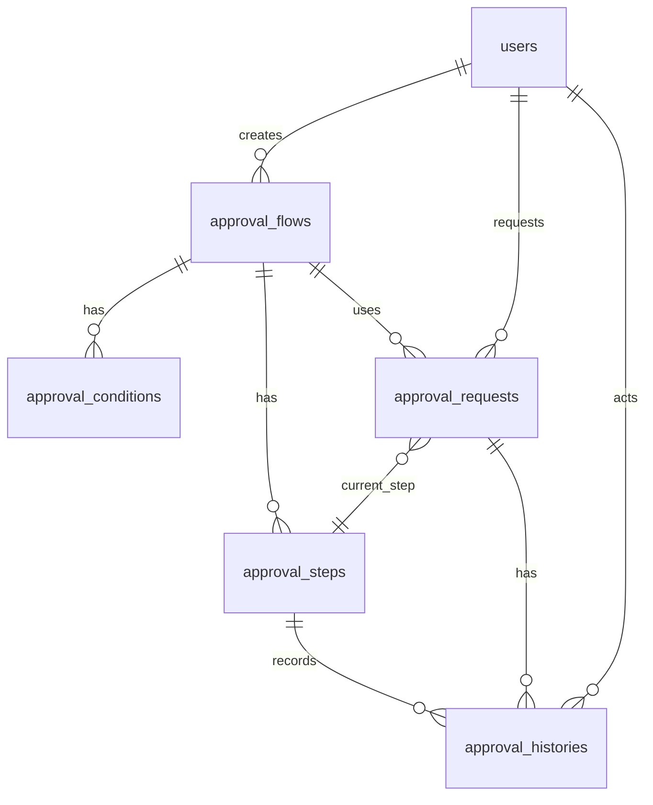

# 承認フロー データベーススキーマ詳細

## 概要

承認フロー機能は5つの主要テーブルで構成されています。各テーブルは明確な責務を持ち、適切なリレーションで結ばれています。

## テーブル構成



## 1. approval_flows テーブル

### 概要
承認フローの基本情報を管理するマスターテーブル

### スキーマ
```sql
CREATE TABLE approval_flows (
    id BIGINT UNSIGNED NOT NULL AUTO_INCREMENT PRIMARY KEY,
    name VARCHAR(255) NOT NULL,                    -- フロー名
    description TEXT NULL,                         -- 説明
    flow_type VARCHAR(50) NOT NULL,               -- フロータイプ
    is_active BOOLEAN NOT NULL DEFAULT 1,         -- アクティブ状態
    is_system BOOLEAN NOT NULL DEFAULT 0,         -- システムフロー
    priority INT NOT NULL DEFAULT 0,              -- 優先度
    created_by BIGINT UNSIGNED NULL,              -- 作成者
    updated_by BIGINT UNSIGNED NULL,              -- 更新者
    created_at TIMESTAMP NULL,
    updated_at TIMESTAMP NULL,
    deleted_at TIMESTAMP NULL,
    
    INDEX idx_flow_type (flow_type),
    INDEX idx_is_active (is_active),
    INDEX idx_is_system (is_system),
    INDEX idx_priority (priority),
    FOREIGN KEY (created_by) REFERENCES users(id) ON DELETE SET NULL,
    FOREIGN KEY (updated_by) REFERENCES users(id) ON DELETE SET NULL
);
```

### フィールド詳細
- **flow_type**: `estimate`, `budget`, `order`, `progress`, `payment`
- **is_system**: システム標準フローかカスタムフローかを区別
- **priority**: 同一条件に複数フローが該当した場合の優先度

### 使用例
```php
// 見積承認フローの作成
ApprovalFlow::create([
    'name' => '見積承認フロー（100万円以上）',
    'flow_type' => 'estimate',
    'is_active' => true,
    'priority' => 10
]);
```

## 2. approval_steps テーブル

### 概要
承認フローの各ステップを定義するテーブル

### スキーマ
```sql
CREATE TABLE approval_steps (
    id BIGINT UNSIGNED NOT NULL AUTO_INCREMENT PRIMARY KEY,
    approval_flow_id BIGINT UNSIGNED NOT NULL,    -- 承認フローID
    step_order INT NOT NULL,                      -- ステップ順序
    name VARCHAR(255) NOT NULL,                   -- ステップ名
    description TEXT NULL,                        -- 説明
    approver_type VARCHAR(50) NOT NULL,           -- 承認者タイプ
    approver_id BIGINT UNSIGNED NULL,             -- 承認者ID
    approver_condition JSON NULL,                 -- 承認条件
    is_required BOOLEAN NOT NULL DEFAULT 1,       -- 必須フラグ
    can_delegate BOOLEAN NOT NULL DEFAULT 0,      -- 委譲可能フラグ
    timeout_hours INT NULL,                       -- タイムアウト時間
    is_active BOOLEAN NOT NULL DEFAULT 1,         -- アクティブ状態
    created_by BIGINT UNSIGNED NULL,              -- 作成者
    updated_by BIGINT UNSIGNED NULL,              -- 更新者
    created_at TIMESTAMP NULL,
    updated_at TIMESTAMP NULL,
    deleted_at TIMESTAMP NULL,
    
    INDEX idx_approval_flow_id (approval_flow_id),
    INDEX idx_step_order (step_order),
    INDEX idx_approver_type (approver_type),
    INDEX idx_approver_id (approver_id),
    INDEX idx_is_active (is_active),
    FOREIGN KEY (approval_flow_id) REFERENCES approval_flows(id) ON DELETE CASCADE,
    FOREIGN KEY (created_by) REFERENCES users(id) ON DELETE SET NULL,
    FOREIGN KEY (updated_by) REFERENCES users(id) ON DELETE SET NULL
);
```

### フィールド詳細
- **approver_type**: `user`, `role`, `department`, `system_level`
- **approver_id**: approver_typeに応じた承認者のID
- **approver_condition**: 承認条件をJSON形式で格納
- **timeout_hours**: ステップのタイムアウト時間（時間単位）

### 承認者タイプ別の動作
```php
// ユーザー指定
['approver_type' => 'user', 'approver_id' => 1]

// 役割指定
['approver_type' => 'role', 'approver_id' => 2]

// 部署指定
['approver_type' => 'department', 'approver_id' => 3]

// システム権限レベル指定
['approver_type' => 'system_level', 'approver_id' => 4]
```

## 3. approval_conditions テーブル

### 概要
承認フローの適用条件を定義するテーブル

### スキーマ
```sql
CREATE TABLE approval_conditions (
    id BIGINT UNSIGNED NOT NULL AUTO_INCREMENT PRIMARY KEY,
    approval_flow_id BIGINT UNSIGNED NOT NULL,    -- 承認フローID
    condition_type VARCHAR(50) NOT NULL,          -- 条件タイプ
    field_name VARCHAR(100) NOT NULL,             -- フィールド名
    operator VARCHAR(50) NOT NULL,                -- 演算子
    value JSON NULL,                              -- 条件値
    value_type VARCHAR(20) NOT NULL DEFAULT 'string', -- 値タイプ
    is_active BOOLEAN NOT NULL DEFAULT 1,         -- アクティブ状態
    priority INT NOT NULL DEFAULT 0,              -- 優先度
    description TEXT NULL,                        -- 説明
    created_by BIGINT UNSIGNED NULL,              -- 作成者
    updated_by BIGINT UNSIGNED NULL,              -- 更新者
    created_at TIMESTAMP NULL,
    updated_at TIMESTAMP NULL,
    deleted_at TIMESTAMP NULL,
    
    INDEX idx_approval_flow_id (approval_flow_id),
    INDEX idx_condition_type (condition_type),
    INDEX idx_field_name (field_name),
    INDEX idx_operator (operator),
    INDEX idx_is_active (is_active),
    INDEX idx_priority (priority),
    FOREIGN KEY (approval_flow_id) REFERENCES approval_flows(id) ON DELETE CASCADE,
    FOREIGN KEY (created_by) REFERENCES users(id) ON DELETE SET NULL,
    FOREIGN KEY (updated_by) REFERENCES users(id) ON DELETE SET NULL
);
```

### 条件タイプ
- **amount**: 金額条件
- **department**: 部署条件
- **role**: 役割条件
- **project**: プロジェクト条件
- **custom**: カスタム条件

### 演算子
- **equals**: 等しい
- **not_equals**: 等しくない
- **greater_than**: より大きい
- **less_than**: より小さい
- **greater_than_or_equal**: 以上
- **less_than_or_equal**: 以下
- **contains**: 含む
- **not_contains**: 含まない
- **in**: 含まれる
- **not_in**: 含まれない
- **is_null**: 空
- **is_not_null**: 空でない

### 条件例
```php
// 金額条件：100万円以上
[
    'condition_type' => 'amount',
    'field_name' => 'total_amount',
    'operator' => 'greater_than_or_equal',
    'value' => 1000000,
    'value_type' => 'integer'
]

// 部署条件：営業部
[
    'condition_type' => 'department',
    'field_name' => 'department_id',
    'operator' => 'equals',
    'value' => 1,
    'value_type' => 'integer'
]
```

## 4. approval_requests テーブル

### 概要
実際の承認依頼を管理するテーブル

### スキーマ
```sql
CREATE TABLE approval_requests (
    id BIGINT UNSIGNED NOT NULL AUTO_INCREMENT PRIMARY KEY,
    approval_flow_id BIGINT UNSIGNED NOT NULL,    -- 承認フローID
    request_type VARCHAR(50) NOT NULL,            -- 依頼タイプ
    request_id BIGINT UNSIGNED NOT NULL,          -- 依頼元ID
    title VARCHAR(255) NOT NULL,                  -- タイトル
    description TEXT NULL,                        -- 説明
    request_data JSON NULL,                       -- 依頼データ
    current_step BIGINT UNSIGNED NULL,            -- 現在のステップ
    status VARCHAR(20) NOT NULL DEFAULT 'pending', -- ステータス
    priority VARCHAR(20) NOT NULL DEFAULT 'normal', -- 優先度
    requested_by BIGINT UNSIGNED NOT NULL,        -- 依頼者
    approved_by BIGINT UNSIGNED NULL,             -- 承認者
    approved_at TIMESTAMP NULL,                   -- 承認日時
    rejected_by BIGINT UNSIGNED NULL,             -- 却下者
    rejected_at TIMESTAMP NULL,                   -- 却下日時
    returned_by BIGINT UNSIGNED NULL,             -- 差し戻し者
    returned_at TIMESTAMP NULL,                   -- 差し戻し日時
    cancelled_by BIGINT UNSIGNED NULL,            -- キャンセル者
    cancelled_at TIMESTAMP NULL,                  -- キャンセル日時
    expires_at TIMESTAMP NULL,                    -- 期限日時
    created_by BIGINT UNSIGNED NULL,              -- 作成者
    updated_by BIGINT UNSIGNED NULL,              -- 更新者
    created_at TIMESTAMP NULL,
    updated_at TIMESTAMP NULL,
    deleted_at TIMESTAMP NULL,
    
    INDEX idx_approval_flow_id (approval_flow_id),
    INDEX idx_request_type (request_type),
    INDEX idx_request_id (request_id),
    INDEX idx_current_step (current_step),
    INDEX idx_status (status),
    INDEX idx_priority (priority),
    INDEX idx_requested_by (requested_by),
    INDEX idx_approved_by (approved_by),
    INDEX idx_rejected_by (rejected_by),
    INDEX idx_returned_by (returned_by),
    INDEX idx_cancelled_by (cancelled_by),
    INDEX idx_expires_at (expires_at),
    FOREIGN KEY (approval_flow_id) REFERENCES approval_flows(id) ON DELETE CASCADE,
    FOREIGN KEY (current_step) REFERENCES approval_steps(id) ON DELETE SET NULL,
    FOREIGN KEY (requested_by) REFERENCES users(id) ON DELETE CASCADE,
    FOREIGN KEY (approved_by) REFERENCES users(id) ON DELETE SET NULL,
    FOREIGN KEY (rejected_by) REFERENCES users(id) ON DELETE SET NULL,
    FOREIGN KEY (returned_by) REFERENCES users(id) ON DELETE SET NULL,
    FOREIGN KEY (cancelled_by) REFERENCES users(id) ON DELETE SET NULL,
    FOREIGN KEY (created_by) REFERENCES users(id) ON DELETE SET NULL,
    FOREIGN KEY (updated_by) REFERENCES users(id) ON DELETE SET NULL
);
```

### ステータス
- **pending**: 承認待ち
- **approved**: 承認済み
- **rejected**: 却下
- **returned**: 差し戻し
- **cancelled**: キャンセル

### 優先度
- **low**: 低
- **normal**: 通常
- **high**: 高
- **urgent**: 緊急

## 5. approval_histories テーブル

### 概要
承認処理の履歴を記録するテーブル

### スキーマ
```sql
CREATE TABLE approval_histories (
    id BIGINT UNSIGNED NOT NULL AUTO_INCREMENT PRIMARY KEY,
    approval_request_id BIGINT UNSIGNED NOT NULL, -- 承認依頼ID
    approval_step_id BIGINT UNSIGNED NULL,        -- 承認ステップID
    action VARCHAR(20) NOT NULL,                  -- アクション
    acted_by BIGINT UNSIGNED NOT NULL,            -- 実行者
    acted_at TIMESTAMP NOT NULL DEFAULT CURRENT_TIMESTAMP, -- 実行日時
    comment TEXT NULL,                            -- コメント
    delegated_to BIGINT UNSIGNED NULL,            -- 委譲先
    delegated_at TIMESTAMP NULL,                  -- 委譲日時
    created_by BIGINT UNSIGNED NULL,              -- 作成者
    updated_by BIGINT UNSIGNED NULL,              -- 更新者
    created_at TIMESTAMP NULL,
    updated_at TIMESTAMP NULL,
    deleted_at TIMESTAMP NULL,
    
    INDEX idx_approval_request_id (approval_request_id),
    INDEX idx_approval_step_id (approval_step_id),
    INDEX idx_action (action),
    INDEX idx_acted_by (acted_by),
    INDEX idx_acted_at (acted_at),
    INDEX idx_delegated_to (delegated_to),
    FOREIGN KEY (approval_request_id) REFERENCES approval_requests(id) ON DELETE CASCADE,
    FOREIGN KEY (approval_step_id) REFERENCES approval_steps(id) ON DELETE SET NULL,
    FOREIGN KEY (acted_by) REFERENCES users(id) ON DELETE CASCADE,
    FOREIGN KEY (delegated_to) REFERENCES users(id) ON DELETE SET NULL,
    FOREIGN KEY (created_by) REFERENCES users(id) ON DELETE SET NULL,
    FOREIGN KEY (updated_by) REFERENCES users(id) ON DELETE SET NULL
);
```

### アクション
- **approve**: 承認
- **reject**: 却下
- **return**: 差し戻し
- **cancel**: キャンセル
- **delegate**: 委譲

## インデックス戦略

### パフォーマンス最適化
各テーブルには以下の観点でインデックスを設定：

1. **外部キー**: 全ての外部キーにインデックス
2. **検索条件**: よく使用される検索条件にインデックス
3. **ソート条件**: ソートに使用されるカラムにインデックス
4. **複合インデックス**: 複数条件での検索に対応

### クエリ例とインデックス活用
```sql
-- 承認待ちの依頼一覧（idx_status活用）
SELECT * FROM approval_requests WHERE status = 'pending';

-- 特定ユーザーの承認依頼（idx_requested_by活用）
SELECT * FROM approval_requests WHERE requested_by = 1;

-- 期限切れ依頼の検索（idx_expires_at活用）
SELECT * FROM approval_requests WHERE expires_at < NOW();
```

## データ整合性

### 制約条件
1. **外部キー制約**: データ整合性を保証
2. **CASCADE削除**: 親レコード削除時の子レコード処理
3. **SET NULL**: 参照先削除時のNULL設定

### トランザクション管理
承認処理では複数テーブルの更新が発生するため、適切なトランザクション管理が重要：

```php
DB::transaction(function () use ($request, $user, $comment) {
    // 1. approval_requests更新
    $request->update(['status' => 'approved', 'approved_by' => $user->id]);
    
    // 2. approval_histories作成
    $request->histories()->create([
        'action' => 'approve',
        'acted_by' => $user->id,
        'comment' => $comment
    ]);
});
```

## 拡張性への配慮

### JSON フィールドの活用
- **approver_condition**: 複雑な承認条件を柔軟に定義
- **request_data**: 依頼タイプ別の異なるデータ構造に対応
- **value**: 条件値の様々なデータ型に対応

### ソフトデリート
全テーブルでソフトデリートを採用し、データの論理削除により履歴保持とデータ復旧を可能にしています。

## まとめ

この承認フローのデータベース設計は以下の特徴を持ちます：

1. **柔軟性**: 様々な承認パターンに対応可能
2. **拡張性**: 新しい要件に対して容易に拡張可能
3. **整合性**: 適切な制約により データ整合性を保証
4. **パフォーマンス**: 最適なインデックス設計
5. **監査性**: 完全な履歴管理機能
