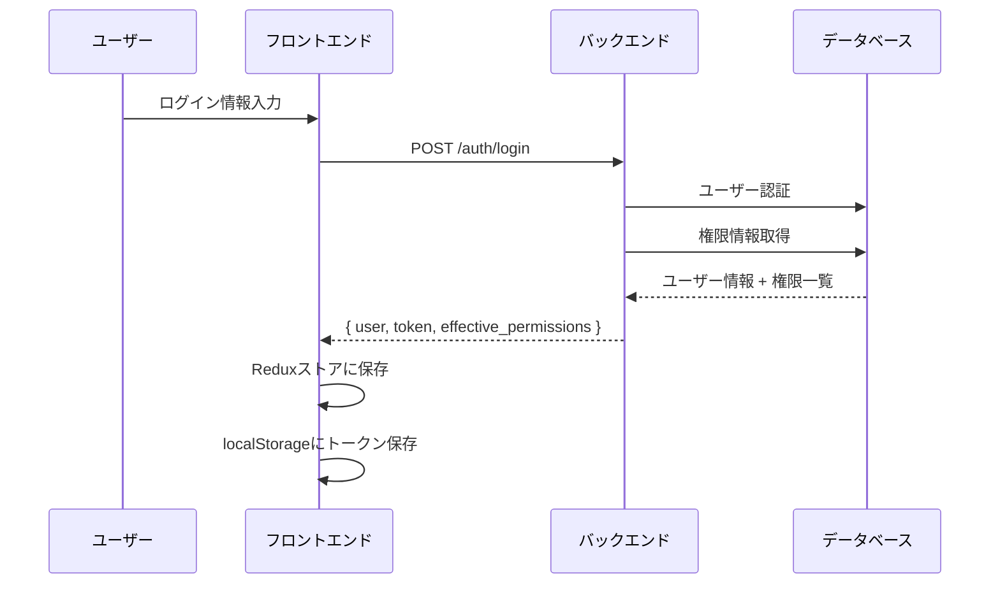
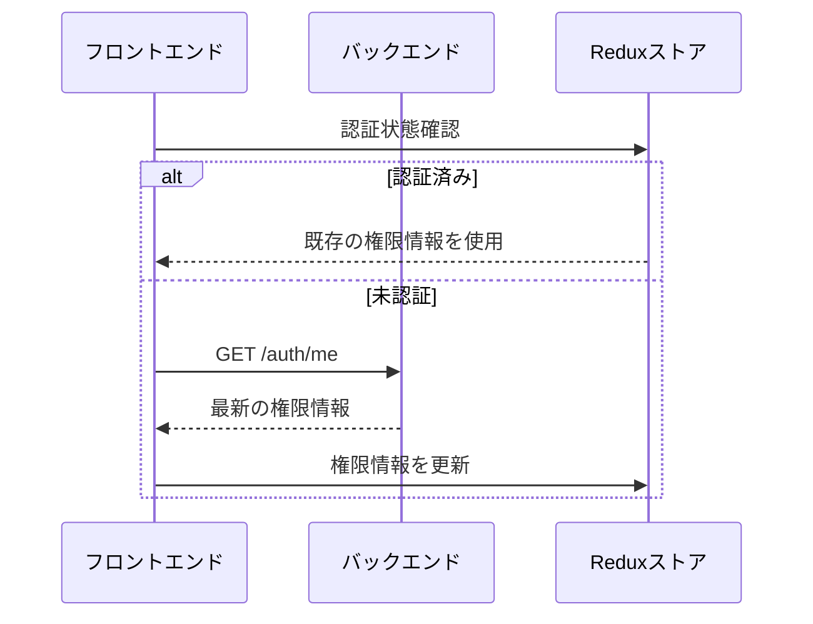

# 認証・権限システム取得ルール

## 概要

本システムの認証・権限管理における権限情報の取得タイミング、更新ルール、キャッシュ戦略について定義します。

## 目次

1. [認証フロー](#認証フロー)
2. [権限取得ルール](#権限取得ルール)
3. [権限更新タイミング](#権限更新タイミング)
4. [キャッシュ戦略](#キャッシュ戦略)
5. [実装ガイドライン](#実装ガイドライン)
6. [トラブルシューティング](#トラブルシューティング)

## 認証フロー

### 1. ログイン時



### 2. ページリダイレクト時



## 権限取得ルール

### 1. 初期取得

| タイミング | 取得方法 | 対象情報 |
|-----------|----------|----------|
| ログイン時 | `/auth/login` | ユーザー情報 + 全権限 |
| ページリロード時 | `/auth/me` | ユーザー情報 + 全権限 |
| トークン検証時 | `/auth/me` | ユーザー情報 + 全権限 |

### 2. 権限計算ロジック

```typescript
// 5階層の権限システム
const effectivePermissions = [
  ...systemLevelPermissions,    // システム権限レベル
  ...rolePermissions,          // 役割
  ...departmentPermissions,    // 部署
  ...positionPermissions,      // 職位
  ...userPermissions           // 個別ユーザー権限
].filter((permission, index, array) => 
  array.indexOf(permission) === index // 重複除去
)
```

### 3. 権限判定API

```typescript
// バックエンド: PermissionService::hasPermission()
public static function hasPermission(User $user, string $permissionName): bool
{
  // 1. システム管理者は全権限を持つ
  if ($user->is_admin || $user->system_level === 'システム管理者') {
    return true;
  }

  // 2-6. 5階層の権限チェック
  return $this->checkSystemLevelPermissions($user, $permissionName) ||
         $this->checkRolePermissions($user, $permissionName) ||
         $this->checkDepartmentPermissions($user, $permissionName) ||
         $this->checkPositionPermissions($user, $permissionName) ||
         $this->checkUserPermissions($user, $permissionName);
}
```

## 権限更新タイミング

### 1. 自動更新

| タイミング | 更新内容 | 実装場所 |
|-----------|----------|----------|
| ページフォーカス時 | 全権限 | AuthProvider |
| 定期更新（30秒） | 全権限 | AuthProvider |
| 権限変更後 | 該当権限 | 権限管理ページ |

### 2. 手動更新

| 操作 | 更新タイミング | 対象 |
|------|----------------|------|
| 権限付与/削除 | 即座 | 変更された権限 |
| 役割変更 | 即座 | 全権限 |
| 部署変更 | 即座 | 全権限 |
| 職位変更 | 即座 | 全権限 |

### 3. 更新実装例

```typescript
// AuthProvider.tsx
useEffect(() => {
  const handleFocus = async () => {
    if (isAuthenticated) {
      try {
        const { effectivePermissions } = await authService.me()
        dispatch(updatePermissions(effectivePermissions))
      } catch (error) {
        console.error('Permission update failed:', error)
      }
    }
  }

  // ページフォーカス時の更新
  window.addEventListener('focus', handleFocus)
  
  // 定期更新（30秒間隔）
  const interval = setInterval(handleFocus, 30000)
  
  return () => {
    window.removeEventListener('focus', handleFocus)
    clearInterval(interval)
  }
}, [isAuthenticated])
```

## キャッシュ戦略

### 1. フロントエンドキャッシュ

| データ | 保存場所 | 有効期限 | 更新条件 |
|--------|----------|----------|----------|
| ユーザー情報 | Reduxストア | セッション中 | ログアウト時 |
| 権限一覧 | Reduxストア | セッション中 | 権限変更時 |
| トークン | localStorage | 永続 | ログアウト時 |

### 2. バックエンドキャッシュ

| データ | 保存場所 | 有効期限 | 更新条件 |
|--------|----------|----------|----------|
| 権限情報 | データベース | 永続 | 権限変更時 |
| ユーザー情報 | データベース | 永続 | プロフィール変更時 |

### 3. キャッシュ無効化ルール

```typescript
// 権限変更時のキャッシュ無効化
const invalidatePermissionCache = () => {
  // 1. フロントエンドの権限情報をクリア
  dispatch(clearPermissions())
  
  // 2. 最新の権限情報を取得
  const { effectivePermissions } = await authService.me()
  dispatch(updatePermissions(effectivePermissions))
  
  // 3. 関連するUIコンポーネントを再レンダリング
  window.location.reload() // 必要に応じて
}
```

## 実装ガイドライン

### 1. 権限チェックの実装

```typescript
// ✅ 推奨: フロントエンドでの権限チェック
const hasPermission = (permission: string): boolean => {
  return effectivePermissions.includes(permission)
}

// ✅ 推奨: バックエンドでの権限チェック
public function canRequestApproval(): bool
{
  if (auth()->check()) {
    $user = auth()->user();
    return PermissionService::hasPermission($user, 'estimate.approval.request');
  }
  return false;
}
```

### 2. 権限更新の実装

```typescript
// ✅ 推奨: 権限変更後の即座更新
const handlePermissionChange = async () => {
  try {
    // 1. バックエンドで権限を変更
    await permissionService.updatePermission(permissionId, isEnabled)
    
    // 2. フロントエンドの権限情報を更新
    const { effectivePermissions } = await authService.me()
    dispatch(updatePermissions(effectivePermissions))
    
    // 3. 成功通知
    toast.success('権限を更新しました')
  } catch (error) {
    toast.error('権限の更新に失敗しました')
  }
}
```

### 3. エラーハンドリング

```typescript
// ✅ 推奨: 権限取得エラーの処理
const handlePermissionError = (error: Error) => {
  if (error.status === 401) {
    // 認証エラーの場合はログアウト
    dispatch(logout())
    router.push('/login')
  } else if (error.status === 403) {
    // 権限エラーの場合は権限不足ページへ
    router.push('/unauthorized')
  } else {
    // その他のエラーは再試行
    setTimeout(() => {
      refreshPermissions()
    }, 5000)
  }
}
```

## トラブルシューティング

### 1. よくある問題

#### 問題: 権限変更が反映されない

**原因**: フロントエンドの権限情報が古い

**解決策**:
```typescript
// 1. 手動で権限を更新
const refreshPermissions = async () => {
  const { effectivePermissions } = await authService.me()
  dispatch(updatePermissions(effectivePermissions))
}

// 2. ページをリロード
window.location.reload()
```

#### 問題: 承認依頼ボタンが表示されない

**原因**: 権限判定が正しく動作していない

**解決策**:
```typescript
// 1. 権限の確認
console.log('User permissions:', effectivePermissions)
console.log('Required permission:', 'estimate.approval.request')
console.log('Has permission:', effectivePermissions.includes('estimate.approval.request'))

// 2. バックエンドの権限確認
const canRequest = await estimateService.canRequestApproval(estimateId)
console.log('Can request approval:', canRequest)
```

#### 問題: 認証状態が正しく取得されない

**原因**: トークンの有効期限切れ

**解決策**:
```typescript
// 1. トークンの確認
const token = localStorage.getItem('token')
console.log('Token exists:', !!token)

// 2. トークンの検証
try {
  const { user } = await authService.me()
  console.log('User authenticated:', !!user)
} catch (error) {
  console.error('Authentication failed:', error)
  // ログアウト処理
  dispatch(logout())
}
```

### 2. デバッグツール

#### 権限情報の確認

```typescript
// 開発環境での権限デバッグ
if (process.env.NODE_ENV === 'development') {
  window.debugPermissions = () => {
    console.log('Current user:', user)
    console.log('Effective permissions:', effectivePermissions)
    console.log('Is authenticated:', isAuthenticated)
  }
}
```

#### 権限チェックのテスト

```typescript
// 権限チェックのテスト関数
const testPermission = (permission: string) => {
  const hasPermission = effectivePermissions.includes(permission)
  console.log(`Permission "${permission}": ${hasPermission ? '✅' : '❌'}`)
  return hasPermission
}

// 使用例
testPermission('estimate.approval.request')
testPermission('estimate.create')
testPermission('system.admin')
```

## セキュリティ考慮事項

### 1. 権限情報の保護

- **トークン**: localStorageに保存、HTTPS通信必須
- **権限情報**: メモリ内のみ、永続化しない
- **API通信**: 全通信でトークン認証

### 2. 権限昇格の防止

- **フロントエンド**: UI制御のみ、セキュリティの最終防壁ではない
- **バックエンド**: 全てのAPIで権限チェック必須
- **データベース**: 行レベルセキュリティの実装

### 3. 監査ログ

```typescript
// 権限変更の監査ログ
const logPermissionChange = (action: string, permission: string, target: string) => {
  console.log(`[AUDIT] ${action}: ${permission} for ${target} by ${user.name}`)
  // 実際の実装では監査ログAPIに送信
}
```

## パフォーマンス最適化

### 1. 権限情報の最適化

- **重複除去**: 同じ権限の重複を排除
- **キャッシュ**: 頻繁にアクセスされる権限をキャッシュ
- **遅延読み込み**: 必要時のみ権限情報を取得

### 2. API呼び出しの最適化

- **バッチ処理**: 複数の権限チェックを一度に実行
- **条件付き更新**: 変更があった場合のみ権限を更新
- **並列処理**: 複数の権限チェックを並列実行

## まとめ

本システムの認証・権限管理は以下の原則に基づいて実装されています：

1. **セキュリティファースト**: バックエンドでの権限チェックを最優先
2. **リアルタイム更新**: 権限変更を即座に反映
3. **ユーザビリティ**: 権限不足時の適切なフィードバック
4. **パフォーマンス**: 効率的な権限情報の管理

これらのルールに従って実装することで、安全で使いやすい権限管理システムを構築できます。
