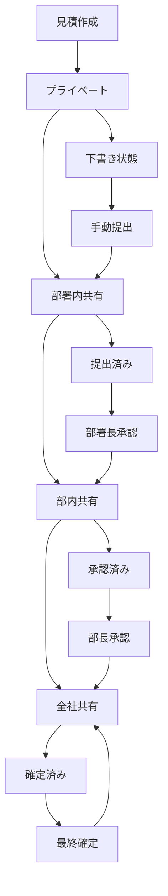

# データ可視性制御仕様書

## 概要

本システムにおける業務データの可視性制御について、統一的な運用方針と実装仕様を定義する。

## 基本方針

### 1. 段階的可視性制御
- **作成時**: プライベート（作成者のみ）
- **業務フロー進行**: 段階的に可視性を拡張
- **権限ベース**: 役職に応じた閲覧範囲

### 2. セキュリティ原則
- **最小権限の原則**: 必要最小限のアクセス権限
- **明示的権限**: 暗黙的な権限は避ける
- **監査可能性**: アクセスログの記録

## データ可視性レベル

### 可視性レベル定義

| レベル | コード | 説明 | 適用場面 |
|--------|--------|------|----------|
| **プライベート** | `private` | 作成者のみ閲覧可能 | 作成時、下書き状態 |
| **部署内共有** | `department` | 同部署メンバーが閲覧可能 | 部署内での進捗管理 |
| **全社共有** | `company` | 全社員が閲覧可能 | 経営層向け、公開データ |

**注意**: 現状の組織構成では `division`（部）の概念がないため、部署（`department`）を基本単位として運用する。

### 権限マトリックス

| 役職 | プライベート | 部署内 | 全社 |
|------|-------------|--------|------|
| **一般社員** | 自分のみ | 部署内 | - |
| **主任** | 自分のみ | 部署内 | - |
| **課長** | 自分のみ | 部署内 | 全社 |
| **部長** | 自分のみ | 部署内 | 全社 |
| **役員** | 自分のみ | 部署内 | 全社 |
| **管理者** | 全データ | 全データ | 全データ |

## 組織構造管理

### 1. 組織階層の定義

#### **組織構造テーブル**

```sql
-- 部署テーブル
CREATE TABLE departments (
    id SERIAL PRIMARY KEY,
    name VARCHAR(100) NOT NULL,
    code VARCHAR(20) UNIQUE NOT NULL,
    parent_department_id INTEGER REFERENCES departments(id),
    division_id INTEGER REFERENCES divisions(id),
    level INTEGER NOT NULL DEFAULT 1, -- 組織階層レベル
    is_active BOOLEAN DEFAULT true,
    created_at TIMESTAMP DEFAULT CURRENT_TIMESTAMP,
    updated_at TIMESTAMP DEFAULT CURRENT_TIMESTAMP
);

-- 部テーブル
CREATE TABLE divisions (
    id SERIAL PRIMARY KEY,
    name VARCHAR(100) NOT NULL,
    code VARCHAR(20) UNIQUE NOT NULL,
    parent_division_id INTEGER REFERENCES divisions(id),
    level INTEGER NOT NULL DEFAULT 1,
    is_active BOOLEAN DEFAULT true,
    created_at TIMESTAMP DEFAULT CURRENT_TIMESTAMP,
    updated_at TIMESTAMP DEFAULT CURRENT_TIMESTAMP
);

-- 社員テーブル（既存）
CREATE TABLE employees (
    id SERIAL PRIMARY KEY,
    name VARCHAR(100) NOT NULL,
    employee_code VARCHAR(20) UNIQUE NOT NULL,
    department_id INTEGER REFERENCES departments(id),
    division_id INTEGER REFERENCES divisions(id),
    position_id INTEGER REFERENCES positions(id),
    role VARCHAR(50) DEFAULT 'employee', -- employee, manager, admin
    is_active BOOLEAN DEFAULT true,
    created_at TIMESTAMP DEFAULT CURRENT_TIMESTAMP,
    updated_at TIMESTAMP DEFAULT CURRENT_TIMESTAMP
);

-- 役職テーブル
CREATE TABLE positions (
    id SERIAL PRIMARY KEY,
    name VARCHAR(100) NOT NULL,
    level INTEGER NOT NULL, -- 役職レベル（数値が大きいほど上位）
    is_management BOOLEAN DEFAULT false, -- 管理職フラグ
    created_at TIMESTAMP DEFAULT CURRENT_TIMESTAMP
);
```

#### **組織階層の例**

```
会社
├── 営業部 (division_id: 1)
│   ├── 営業1課 (department_id: 1, parent: null)
│   ├── 営業2課 (department_id: 2, parent: null)
│   └── 営業企画課 (department_id: 3, parent: null)
├── 技術部 (division_id: 2)
│   ├── 開発課 (department_id: 4, parent: null)
│   ├── 設計課 (department_id: 5, parent: null)
│   └── 品質管理課 (department_id: 6, parent: null)
└── 管理部 (division_id: 3)
    ├── 総務課 (department_id: 7, parent: null)
    ├── 人事課 (department_id: 8, parent: null)
    └── 経理課 (department_id: 9, parent: null)
```

### 2. 部署・部内判定ロジック

#### **部署内判定**

```php
// 部署内判定の実装
class DepartmentService
{
    /**
     * 同部署メンバーかどうかを判定
     */
    public function isSameDepartment($user1Id, $user2Id): bool
    {
        $user1 = Employee::find($user1Id);
        $user2 = Employee::find($user2Id);
        
        return $user1 && $user2 && 
               $user1->department_id === $user2->department_id;
    }

    /**
     * 部署内の全メンバーを取得
     */
    public function getDepartmentMembers($departmentId): Collection
    {
        return Employee::where('department_id', $departmentId)
            ->where('is_active', true)
            ->get();
    }

    /**
     * 部署の階層構造を取得
     */
    public function getDepartmentHierarchy($departmentId): array
    {
        $department = Department::find($departmentId);
        $hierarchy = [$department];
        
        // 親部署を再帰的に取得
        while ($department->parent_department_id) {
            $department = Department::find($department->parent_department_id);
            $hierarchy[] = $department;
        }
        
        return $hierarchy;
    }
}
```

#### **部内判定**

```php
// 部内判定の実装
class DivisionService
{
    /**
     * 同部メンバーかどうかを判定
     */
    public function isSameDivision($user1Id, $user2Id): bool
    {
        $user1 = Employee::find($user1Id);
        $user2 = Employee::find($user2Id);
        
        return $user1 && $user2 && 
               $user1->division_id === $user2->division_id;
    }

    /**
     * 部内の全メンバーを取得
     */
    public function getDivisionMembers($divisionId): Collection
    {
        return Employee::where('division_id', $divisionId)
            ->where('is_active', true)
            ->get();
    }

    /**
     * 部内の全部署を取得
     */
    public function getDivisionDepartments($divisionId): Collection
    {
        return Department::where('division_id', $divisionId)
            ->where('is_active', true)
            ->get();
    }
}
```

### 3. 可視性制御での組織判定

#### **更新されたスコープメソッド**

```php
// Estimate.php
public function scopeVisibleTo($query, $user)
{
    return $query->where(function($q) use ($user) {
        // 作成者は常に閲覧可能
        $q->where('created_by', $user->id)
          ->orWhere(function($subQ) use ($user) {
              // 部署内共有
              $subQ->where('visibility', 'department')
                   ->where('department_id', $user->department_id);
          })
          ->orWhere(function($subQ) use ($user) {
              // 部内共有
              $subQ->where('visibility', 'division')
                   ->where('division_id', $user->division_id);
          })
          ->orWhere(function($subQ) use ($user) {
              // 全社共有
              $subQ->where('visibility', 'company');
          })
          ->orWhere(function($subQ) use ($user) {
              // 管理職は部署内全データ閲覧可能
              if ($this->isManagement($user)) {
                  $subQ->where('department_id', $user->department_id);
              }
          });
    });
}

/**
 * 管理職かどうかを判定
 */
private function isManagement($user): bool
{
    $position = Position::find($user->position_id);
    return $position && $position->is_management;
}
```

## データベース設計

### 共通スキーマ

```sql
-- 全業務データテーブルに追加する共通カラム
ALTER TABLE {table_name} ADD COLUMN visibility VARCHAR(20) DEFAULT 'private';
ALTER TABLE {table_name} ADD COLUMN department_id INTEGER REFERENCES departments(id);
ALTER TABLE {table_name} ADD COLUMN division_id INTEGER REFERENCES divisions(id);
ALTER TABLE {table_name} ADD COLUMN created_by INTEGER REFERENCES employees(id);

-- パフォーマンス向上のためのインデックス
CREATE INDEX idx_{table_name}_visibility ON {table_name}(visibility, department_id, division_id, created_by);
```

### 対象テーブル

- `estimates` - 見積データ
- `projects` - プロジェクトデータ
- `contracts` - 契約データ
- `invoices` - 請求データ
- `purchase_orders` - 発注データ
- `reports` - レポートデータ
- `documents` - 文書データ

## 現在の実装状況と追加実装

### 1. 既存の組織構造

#### **現在のテーブル構成**
```sql
-- 既存: departments テーブル
departments: id, name, code, description, parent_id, level, path, sort_order, manager_id, is_active, created_at, updated_at, deleted_at

-- 既存: employees テーブル  
employees: id, employee_id, name, name_kana, email, birth_date, gender, phone, mobile_phone, postal_code, prefecture, address, job_title, hire_date, department_id, position_id, is_active, created_at, updated_at, deleted_at

-- 既存: positions テーブル
positions: (詳細は要確認)
```

#### **不足している要素**
- `divisions` テーブル（部テーブル）
- `employees` テーブルの `division_id` カラム
- `departments` テーブルの `division_id` カラム

### 2. 追加実装が必要な要素

#### **divisions テーブルの作成**

```sql
-- divisions テーブル作成
CREATE TABLE divisions (
    id SERIAL PRIMARY KEY,
    name VARCHAR(100) NOT NULL,
    code VARCHAR(20) UNIQUE NOT NULL,
    description TEXT,
    parent_division_id INTEGER REFERENCES divisions(id),
    level INTEGER NOT NULL DEFAULT 1,
    path VARCHAR(500), -- 階層パス
    sort_order INTEGER DEFAULT 0,
    manager_id INTEGER REFERENCES employees(id),
    is_active BOOLEAN DEFAULT true,
    created_at TIMESTAMP DEFAULT CURRENT_TIMESTAMP,
    updated_at TIMESTAMP DEFAULT CURRENT_TIMESTAMP,
    deleted_at TIMESTAMP NULL
);

-- インデックス
CREATE INDEX idx_divisions_parent ON divisions(parent_division_id);
CREATE INDEX idx_divisions_path ON divisions(path);
CREATE INDEX idx_divisions_active ON divisions(is_active);
```

#### **既存テーブルの拡張**

```sql
-- departments テーブルに division_id を追加
ALTER TABLE departments ADD COLUMN division_id INTEGER REFERENCES divisions(id);

-- employees テーブルに division_id を追加
ALTER TABLE employees ADD COLUMN division_id INTEGER REFERENCES divisions(id);

-- インデックス追加
CREATE INDEX idx_departments_division ON departments(division_id);
CREATE INDEX idx_employees_division ON employees(division_id);
```

### 3. 実装手順

#### **Step 1: divisions テーブル作成**

```bash
# マイグレーションファイル作成
php artisan make:migration create_divisions_table

# マイグレーション実行
php artisan migrate
```

#### **Step 2: 既存テーブル拡張**

```bash
# 既存テーブル拡張のマイグレーション作成
php artisan make:migration add_division_id_to_departments_and_employees

# マイグレーション実行
php artisan migrate
```

#### **Step 3: マスターデータ投入**

```php
// DivisionSeeder.php
class DivisionSeeder extends Seeder
{
    public function run()
    {
        $divisions = [
            [
                'name' => '営業部',
                'code' => 'SALES',
                'level' => 1,
                'path' => '/1',
                'sort_order' => 1,
            ],
            [
                'name' => '技術部', 
                'code' => 'TECH',
                'level' => 1,
                'path' => '/2',
                'sort_order' => 2,
            ],
            [
                'name' => '管理部',
                'code' => 'ADMIN',
                'level' => 1,
                'path' => '/3',
                'sort_order' => 3,
            ],
        ];

        foreach ($divisions as $division) {
            Division::create($division);
        }
    }
}
```

#### **Step 4: 既存データの更新**

```php
// 既存の部署データに division_id を設定
$departmentDivisionMap = [
    '営業1課' => 1, // 営業部
    '営業2課' => 1, // 営業部
    '開発課' => 2,  // 技術部
    '設計課' => 2,  // 技術部
    '総務課' => 3,  // 管理部
    '人事課' => 3,  // 管理部
];

foreach ($departmentDivisionMap as $deptName => $divisionId) {
    Department::where('name', $deptName)
        ->update(['division_id' => $divisionId]);
}

// 既存の社員データに division_id を設定
$employees = Employee::with('department')->get();
foreach ($employees as $employee) {
    if ($employee->department && $employee->department->division_id) {
        $employee->update(['division_id' => $employee->department->division_id]);
    }
}
```

### 4. 判定ロジックの実装

#### **更新された判定サービス**

```php
// DepartmentService.php
class DepartmentService
{
    /**
     * 同部署メンバーかどうかを判定
     */
    public function isSameDepartment($user1Id, $user2Id): bool
    {
        $user1 = Employee::find($user1Id);
        $user2 = Employee::find($user2Id);
        
        return $user1 && $user2 && 
               $user1->department_id === $user2->department_id;
    }

    /**
     * 部署内の全メンバーを取得
     */
    public function getDepartmentMembers($departmentId): Collection
    {
        return Employee::where('department_id', $departmentId)
            ->where('is_active', true)
            ->get();
    }
}

// DivisionService.php
class DivisionService
{
    /**
     * 同部メンバーかどうかを判定
     */
    public function isSameDivision($user1Id, $user2Id): bool
    {
        $user1 = Employee::find($user1Id);
        $user2 = Employee::find($user2Id);
        
        return $user1 && $user2 && 
               $user1->division_id === $user2->division_id;
    }

    /**
     * 部内の全メンバーを取得
     */
    public function getDivisionMembers($divisionId): Collection
    {
        return Employee::where('division_id', $divisionId)
            ->where('is_active', true)
            ->get();
    }

    /**
     * 部内の全部署を取得
     */
    public function getDivisionDepartments($divisionId): Collection
    {
        return Department::where('division_id', $divisionId)
            ->where('is_active', true)
            ->get();
    }
}
```

## アプリケーション実装

### 1. Eloquentモデル

#### 共通トレイト

```php
<?php

namespace App\Traits;

trait HasVisibilityControl
{
    /**
     * 指定ユーザーが閲覧可能なデータを取得
     */
    public function scopeVisibleTo($query, $user)
    {
        return $query->where(function($q) use ($user) {
            // 作成者は常に閲覧可能
            $q->where('created_by', $user->id)
              ->orWhere(function($subQ) use ($user) {
                  // 部署内共有
                  $subQ->where('visibility', 'department')
                       ->where('department_id', $user->department_id);
              })
              ->orWhere(function($subQ) use ($user) {
                  // 部内共有
                  $subQ->where('visibility', 'division')
                       ->where('department_id', $user->department_id);
              })
              ->orWhere(function($subQ) use ($user) {
                  // 全社共有
                  $subQ->where('visibility', 'company');
              })
              ->orWhere(function($subQ) use ($user) {
                  // 管理職は部署内全データ閲覧可能
                  if (in_array($user->role, ['manager', 'admin'])) {
                      $subQ->where('department_id', $user->department_id);
                  }
              });
        });
    }

    /**
     * 可視性レベルを変更
     */
    public function changeVisibility($level, $user)
    {
        // 権限チェック
        if (!$this->canChangeVisibility($user, $level)) {
            throw new \Exception('可視性を変更する権限がありません');
        }

        $this->visibility = $level;
        $this->save();

        // 監査ログ記録
        $this->logVisibilityChange($user, $level);
    }

    /**
     * 可視性変更権限チェック
     */
    public function canChangeVisibility($user, $level)
    {
        // 作成者は常に変更可能
        if ($this->created_by === $user->id) {
            return true;
        }

        // 管理職は部署内データを変更可能
        if (in_array($user->role, ['manager', 'admin']) && 
            $this->department_id === $user->department_id) {
            return true;
        }

        return false;
    }
}
```

#### モデルでの使用例

```php
<?php

namespace App\Models;

use App\Traits\HasVisibilityControl;

class Estimate extends Model
{
    use HasVisibilityControl;

    protected $fillable = [
        // 既存フィールド
        'project_name',
        'partner_id',
        // ...
        
        // 可視性制御フィールド
        'visibility',
        'department_id',
        'created_by',
    ];

    protected static function boot()
    {
        parent::boot();

        static::creating(function ($model) {
            // 作成時のデフォルト設定
            $model->visibility = 'private';
            $model->department_id = auth()->user()->department_id ?? null;
            $model->created_by = auth()->id();
        });
    }
}
```

### 2. コントローラー

#### 共通コントローラーベース

```php
<?php

namespace App\Http\Controllers;

use App\Traits\HasVisibilityControl;

abstract class BaseController extends Controller
{
    use HasVisibilityControl;

    /**
     * 一覧取得（可視性制御適用）
     */
    protected function getVisibleData($model, $request)
    {
        $user = auth()->user();
        $query = $model::visibleTo($user);

        // 検索・フィルタリング
        if ($request->filled('search')) {
            $query = $this->applySearch($query, $request->search);
        }

        return $query->paginate($request->get('per_page', 20));
    }
}
```

#### 実装例

```php
<?php

namespace App\Http\Controllers;

class EstimateController extends BaseController
{
    public function index(Request $request)
    {
        $estimates = $this->getVisibleData(Estimate::class, $request);
        return response()->json($estimates);
    }

    public function changeVisibility(Request $request, $id)
    {
        $estimate = Estimate::findOrFail($id);
        $estimate->changeVisibility($request->visibility, auth()->user());
        
        return response()->json(['message' => '可視性を変更しました']);
    }
}
```

### 3. フロントエンド

#### 共通フック

```typescript
// hooks/useVisibilityControl.ts
export const useVisibilityControl = () => {
  const changeVisibility = async (id: string, level: string) => {
    const response = await api.patch(`/estimates/${id}/visibility`, {
      visibility: level
    });
    return response.data;
  };

  const getVisibilityOptions = () => [
    { value: 'private', label: 'プライベート' },
    { value: 'department', label: '部署内共有' },
    { value: 'division', label: '部内共有' },
    { value: 'company', label: '全社共有' }
  ];

  return { changeVisibility, getVisibilityOptions };
};
```

#### 可視性設定コンポーネント

```typescript
// components/VisibilityControl.tsx
interface VisibilityControlProps {
  currentVisibility: string;
  onVisibilityChange: (level: string) => void;
  canChange: boolean;
}

export const VisibilityControl: React.FC<VisibilityControlProps> = ({
  currentVisibility,
  onVisibilityChange,
  canChange
}) => {
  const { getVisibilityOptions } = useVisibilityControl();
  const options = getVisibilityOptions();

  return (
    <div className="flex items-center gap-2">
      <Label>可視性:</Label>
      <Select
        value={currentVisibility}
        onValueChange={onVisibilityChange}
        disabled={!canChange}
      >
        {options.map(option => (
          <SelectItem key={option.value} value={option.value}>
            {option.label}
          </SelectItem>
        ))}
      </Select>
    </div>
  );
};
```

## 可視性変更トリガー

### 1. 自動変更トリガー

#### **業務ステータス変更による自動変更**

| データ種別 | ステータス変更 | 可視性変更 | トリガー条件 |
|------------|----------------|------------|--------------|
| **見積** | `draft` → `submitted` | `private` → `department` | 見積提出時 |
| **見積** | `submitted` → `approved` | `department` → `division` | 部署長承認時 |
| **見積** | `approved` → `finalized` | `division` → `company` | 部長最終承認時 |
| **プロジェクト** | `planning` → `active` | `private` → `department` | プロジェクト開始時 |
| **契約** | `draft` → `signed` | `private` → `company` | 契約締結時 |
| **請求** | `draft` → `sent` | `private` → `department` | 請求書送付時 |

#### **時間経過による自動変更**

| データ種別 | 条件 | 可視性変更 | 目的 |
|------------|------|------------|------|
| **見積** | 有効期限切れ | `department` → `company` | 期限切れ見積の全社共有 |
| **プロジェクト** | 完了後30日 | `department` → `company` | 完了プロジェクトの全社共有 |
| **契約** | 更新期限1ヶ月前 | `private` → `department` | 更新準備の部署内共有 |

### 2. 手動変更トリガー

#### **権限者による手動変更**

| 役職 | 変更可能な可視性 | 制限事項 |
|------|------------------|----------|
| **作成者** | 自分のデータのみ | より制限的なレベルへの変更のみ |
| **部署長** | 部署内データ | 部署内レベルまで |
| **部長** | 部内データ | 部内レベルまで |
| **管理者** | 全データ | 制限なし |

#### **手動変更のUI操作**

```typescript
// 可視性変更のUI例
interface VisibilityChangeTrigger {
  // ドロップダウンメニューからの選択
  dropdown: {
    trigger: 'user_selection',
    action: 'change_visibility',
    target: 'current_record'
  },
  
  // 一括変更
  bulk: {
    trigger: 'bulk_action',
    action: 'change_visibility',
    target: 'selected_records'
  },
  
  // 右クリックメニュー
  context: {
    trigger: 'right_click',
    action: 'change_visibility',
    target: 'context_record'
  }
}
```

### 3. 外部システム連携トリガー

#### **承認システム連携**

```php
// 承認システムからの通知による自動変更
class ApprovalSystemIntegration
{
    public function handleApprovalNotification($data)
    {
        $estimate = Estimate::find($data['estimate_id']);
        
        switch ($data['approval_level']) {
            case 'department':
                $estimate->changeVisibility('department', $data['approver']);
                break;
            case 'division':
                $estimate->changeVisibility('division', $data['approver']);
                break;
            case 'company':
                $estimate->changeVisibility('company', $data['approver']);
                break;
        }
    }
}
```

#### **スケジュール処理**

```php
// 定期実行による自動変更
class VisibilityScheduler
{
    public function processExpiredEstimates()
    {
        $expiredEstimates = Estimate::where('expiry_date', '<', now())
            ->where('visibility', 'department')
            ->get();
            
        foreach ($expiredEstimates as $estimate) {
            $estimate->changeVisibility('company', null, 'expired_auto_change');
        }
    }
}
```

## 業務フロー連携

### 1. 見積業務フロー



### 2. トリガー実装例

#### **見積提出時の自動変更**

```php
class EstimateSubmission
{
    public function submit($estimateId)
    {
        $estimate = Estimate::find($estimateId);
        
        // ステータス変更
        $estimate->update(['status' => 'submitted']);
        
        // 可視性自動変更
        $estimate->changeVisibility('department', auth()->user(), 'submission');
        
        // 通知送信
        $this->notifyDepartmentMembers($estimate);
    }
}
```

#### **承認時の自動変更**

```php
class EstimateApproval
{
    public function approve($estimateId, $approvalLevel)
    {
        $estimate = Estimate::find($estimateId);
        
        // 承認レベルに応じた可視性変更
        $visibilityMap = [
            'department' => 'department',
            'division' => 'division',
            'company' => 'company'
        ];
        
        $newVisibility = $visibilityMap[$approvalLevel];
        $estimate->changeVisibility($newVisibility, auth()->user(), 'approval');
        
        // ステータス更新
        $estimate->update(['status' => 'approved']);
    }
}
```

### 2. 自動可視性変更

```php
// 業務フローに応じた自動可視性変更
class EstimateWorkflow
{
    public function submit($estimate)
    {
        $estimate->changeVisibility('department', auth()->user());
        $estimate->update(['status' => 'submitted']);
    }

    public function approve($estimate)
    {
        $estimate->changeVisibility('division', auth()->user());
        $estimate->update(['status' => 'approved']);
    }

    public function finalize($estimate)
    {
        $estimate->changeVisibility('company', auth()->user());
        $estimate->update(['status' => 'finalized']);
    }
}
```

## 監査ログ

### 1. アクセスログ

```php
// データアクセス時のログ記録
class VisibilityAuditLog extends Model
{
    protected $fillable = [
        'user_id',
        'data_type',
        'data_id',
        'action',
        'visibility_level',
        'ip_address',
        'user_agent',
        'created_at'
    ];
}
```

### 2. ログ記録

```php
// 可視性変更時のログ記録
private function logVisibilityChange($user, $level)
{
    VisibilityAuditLog::create([
        'user_id' => $user->id,
        'data_type' => get_class($this),
        'data_id' => $this->id,
        'action' => 'visibility_change',
        'visibility_level' => $level,
        'ip_address' => request()->ip(),
        'user_agent' => request()->userAgent(),
    ]);
}
```

## パフォーマンス考慮

### 1. インデックス戦略

```sql
-- 複合インデックス
CREATE INDEX idx_estimates_visibility_user ON estimates(visibility, department_id, created_by);
CREATE INDEX idx_estimates_created_by ON estimates(created_by);
CREATE INDEX idx_estimates_department ON estimates(department_id);
```

### 2. クエリ最適化

```php
// 効率的なクエリ
public function scopeVisibleTo($query, $user)
{
    return $query->where(function($q) use ($user) {
        $q->where('created_by', $user->id)
          ->orWhere('visibility', 'company')
          ->orWhere(function($subQ) use ($user) {
              $subQ->whereIn('visibility', ['department', 'division'])
                   ->where('department_id', $user->department_id);
          });
    });
}
```

## セキュリティ考慮事項

### 1. 権限昇格防止

```php
// 権限昇格の防止
public function canChangeVisibility($user, $level)
{
    $currentLevel = $this->getVisibilityLevel($this->visibility);
    $newLevel = $this->getVisibilityLevel($level);
    
    // より制限的なレベルへの変更は制限
    if ($newLevel > $currentLevel && !$this->isAdmin($user)) {
        return false;
    }
    
    return true;
}
```

### 2. データ漏洩防止

```php
// 機密データの保護
public function scopeVisibleTo($query, $user)
{
    return $query->where(function($q) use ($user) {
        // 機密データは特別な権限が必要
        $q->where('created_by', $user->id)
          ->orWhere(function($subQ) use ($user) {
              $subQ->where('visibility', 'department')
                   ->where('department_id', $user->department_id)
                   ->where('confidentiality_level', '!=', 'high');
          });
    });
}
```

## 実装計画

### Phase 1: 基盤整備
- [ ] 共通トレイトの作成
- [ ] データベースマイグレーション
- [ ] 基本権限制御の実装

### Phase 2: 見積データ適用
- [ ] Estimateモデルの更新
- [ ] 見積一覧・詳細の可視性制御
- [ ] 可視性変更UIの実装

### Phase 3: 他データへの展開
- [ ] プロジェクトデータへの適用
- [ ] 契約データへの適用
- [ ] 請求データへの適用

### Phase 4: 高度な機能
- [ ] 監査ログの実装
- [ ] 自動可視性変更
- [ ] パフォーマンス最適化

## 運用ガイドライン

### 1. 可視性設定の原則
- 作成時は必ずプライベート
- 業務フローに応じて段階的に公開
- 不要な公開は避ける

### 2. 権限管理
- 定期的な権限見直し
- 退職者・異動者の権限無効化
- 役職変更時の権限更新

### 3. 監査・コンプライアンス
- 月次でのアクセスログ確認
- 異常なアクセスパターンの監視
- データ漏洩時の対応手順

---

**作成日**: 2025-09-29  
**バージョン**: 1.1  
**作成者**: システム開発チーム

## 下書きデータの管理課題と対策

### 1. 下書きデータの管理課題

#### **A. 下書きデータの孤立問題**
- **問題**: 作成者・担当者が退職すると、下書きデータが誰にも見えない状態になる
- **影響**: データの必要性が判断できず、重要な下書きが埋もれる可能性
- **リスク**: 業務継続に必要な情報の喪失、データの重複作成

#### **B. データの価値判断困難**
- **問題**: 下書きの内容を確認できないため、継続すべき案件かどうか不明
- **影響**: 削除すべきデータかどうかの判断ができない
- **リスク**: 不要データの蓄積、ストレージ容量の無駄遣い

### 2. 下書きデータの可視性拡張仕様

#### **A. 部署レベルでの下書き共有**
- **対象**: 下書き状態（`status = 'draft'`）のデータ
- **可視性**: 作成者・担当者 + 同部署メンバーは閲覧可能
- **目的**: 部署内での進捗確認、引継ぎ準備

#### **B. 管理職への下書き可視性**
- **対象**: 部署内の下書きデータ
- **権限**: 管理職（課長以上）は部署内の下書きを閲覧可能
- **目的**: 部署内データの把握、引継ぎ指示

#### **C. 下書きデータの期限管理**
- **期限設定**: 下書き作成から90日間の有効期限
- **通知**: 期限切れ30日前に作成者・管理職に通知
- **処理**: 期限切れ後は自動的に「要確認」ステータスに変更

### 3. 退職者データの引継ぎ仕様

#### **A. 退職時のデータ引継ぎ手順**
1. **データ一覧作成**: 退職者の作成・担当データを一覧化
2. **下書きデータ確認**: 部署長が下書きデータの内容を確認
3. **継続案件特定**: 業務継続に必要な案件を特定
4. **引継ぎ先決定**: 適切な引継ぎ先を決定
5. **権限移譲**: データの権限を引継ぎ先に移譲

#### **B. 引継ぎデータのステータス管理**
- **引継ぎ時**: 下書きデータは「引継ぎ中」ステータスに変更
- **確認期間**: 引継ぎ先に30日間の確認期間を設定
- **最終処理**: 確認期間終了後に「継続」または「削除」を決定

#### **C. 引継ぎデータの通知機能**
- **引継ぎ先通知**: 引継ぎデータの一覧と内容概要を通知
- **管理職通知**: 部署長に引継ぎ完了を報告
- **確認催促**: 確認期間中に定期的な確認催促

### 4. 下書きデータの定期チェック機能

#### **A. 下書きデータの一覧表示**
- **対象**: 30日以上前の下書きデータ
- **表示者**: 部署長・部長
- **目的**: 下書きデータの定期確認、整理

#### **B. 下書きデータの期限管理**
- **30日**: 下書きデータの確認通知
- **60日**: 管理職への報告
- **90日**: データの整理・削除検討

#### **C. 下書きデータの自動整理**
- **期限切れ**: 90日経過後は自動的に「要確認」ステータス
- **通知**: 作成者・管理職に確認依頼を送信
- **最終処理**: 確認なしの場合は自動削除（設定可能）

### 5. 運用ルール

#### **A. 下書きデータの定期確認**
- **週次**: 部署内の下書きデータを確認
- **月次**: 30日以上前の下書きデータをレビュー
- **四半期**: 下書きデータの整理・削除

#### **B. 退職時のデータ引継ぎ手順**
1. 退職者のデータ一覧を作成
2. 下書きデータの内容を確認
3. 継続すべき案件を特定
4. 引継ぎ先を決定
5. データの権限移譲

#### **C. 下書きデータの期限管理**
- **30日**: 下書きデータの確認通知
- **60日**: 管理職への報告
- **90日**: データの整理・削除検討

### 6. 実装の優先順位

#### **A. 即座に実装可能**
1. 部署内での下書きデータ閲覧権限
2. 管理職への下書きデータ可視性
3. 下書きデータの一覧表示機能

#### **B. 中期実装**
1. 下書きデータの期限管理
2. 退職者データの引継ぎ機能
3. 下書きデータの通知機能

#### **C. 長期実装**
1. 下書きデータの自動整理
2. データの価値判定AI
3. 引継ぎデータの自動分類

### 7. セキュリティ考慮事項

#### **A. 下書きデータの機密性**
- **閲覧権限**: 部署内メンバーのみ閲覧可能
- **編集権限**: 作成者・担当者のみ編集可能
- **削除権限**: 作成者・管理職のみ削除可能

#### **B. 引継ぎデータの保護**
- **引継ぎ期間**: 引継ぎ中は編集権限を一時停止
- **確認期間**: 引継ぎ先の確認期間中は読み取り専用
- **最終処理**: 確認期間終了後の適切な処理

### 8. 監査・コンプライアンス

#### **A. 下書きデータのアクセスログ**
- **閲覧ログ**: 下書きデータの閲覧履歴を記録
- **変更ログ**: 下書きデータの変更履歴を記録
- **引継ぎログ**: データ引継ぎの履歴を記録

#### **B. 定期監査**
- **月次**: 下書きデータのアクセス状況を確認
- **四半期**: 引継ぎデータの処理状況を確認
- **年次**: 下書きデータ管理の全体評価
